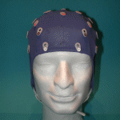

# NeuroBeatsDL
A deep learning exploration of EEG-processed brain topographical maps, uncovering the impact of binaural beats on neural activity.
## Abstract

This project integrates deep learning with image processing and computer vision techniques to quantify the impact of binaural beats on attention span by harnessing EEG data collected across 42 electrodes on the human scalp. The methodology extends beyond traditional signal analysis by preprocessing the EEG signals into brain heat maps—topographical representations of brain activity—leveraged as input into neural network architectures like conditional Generative Adversarial Networks (GANs), 3D Convolutional Neural Networks, autoencoder transformer models, and diffusion models. The networks are designed to anticipate how the brain heat map would evolve in the ensuing moment, hence providing a dynamic measure of attention span, indicated by the color-coded contour lines of the active brain regions. By comparing these predictions in the presence and absence of binaural audio, the project performs a nuanced exploration of how auditory stimuli modulate human neural activity, highlighting the potential of combining deep learning with image processing to understand attention mechanisms.

## Dataset

The dataset involves raw EEG signal files recorded in BIOSEMI Active Two Brain recorder and exported in (.BDF) format. The data consists of deidentified data for 80 participants, recorded for two sessions of 30 minutes each, where one session had just pure tone, while the other session had binaural beats. The EEG signals have a sampling frequency of 512 Hz. Each session consisted of 33 minutes, where the participant had to answer 1200 cognitive ability questions, and their brain activity was recorded via EEG, and their wrong answers were counted. These 1200 questions had a stimulus window of 1500 ms and a response window of 150 ms, hence the total duration of the question was 1.65 seconds.
<table>
  <tr>
    <td></td>
    <td></td>
  </tr>
</table>

## Vital information about the signals

These functions of these electrodes are explained in the below table, along with the positioning of these electrodes on the human brain following the international standard 10-20 system.

| Electrode | Description         | Targeted Brain Area                                                                           |
|-----------|---------------------|-----------------------------------------------------------------------------------------------|
| Fp1, Fp2  | Frontopolar         | Frontal lobe, near the forehead, dealing with executive functions and voluntary movement      |
| AF3, AF4  | Anterior Frontal    | Frontal lobe, responsible for high level cognitive functions                                  |
| F7, F8    | Frontal             | Lateral frontal areas dealing with motor function and language                                |
| F3, F4    | Frontal             | Central frontal areas dealing with decision making and problem solving                        |
| FC1, FC2, FC5, FC6 | Frontocentral | Bridge between frontal and central areas, associated with motor control                    |
| T7, T8    | Temporal            | Middle temporal areas responsible for memory and hearing                                      |
| C3, C4    | Central             | Central brain associated with sensorimotor coordination                                       |
| CP1, CP2, CP5, CP6 | Centroparietal | Linking central and parietal lobes, vital for sensory integration                         |
| P7, P8    | Parietal            | Lateral parietal areas involved with orientation and perception                               |
| P3, P4    | Parietal            | Central parietal areas crucial for sensory input and spatial orientation                      |
| Pz        | Parietal midline    | Top of the head responsible for somatosensory processing                                      |
| PO3, PO4  | Parietal Occipital  | Near the visual cortex, important for visual processing                                       |
| O1, O2    | Occipital           | Back of the head, primary visual processing area                                              |
| Oz        | Occipital midline   | Central occipital, key in visual data processing                                              |
| VEO+, VEO-| Vertical EOG        | Vertical eye movement                                                                         |
| HEOL, HEOR| Horizontal EOG      | Horizontal eye movement                                                                       |
| FCz, Cz   | Central midline     | Central area of the head involved for motor function                                          |
| Iz        | Inion               | Near the back of the skull, used for referencing the EEG                                      |
| M1, M2    | Mastoid reference   | Located near the mastoids behind the ears (left and right earlobes), used for referencing the EEG signals |
| B9, B10   | Additional          | Supplementary electrodes for specific studies                                                 |

<table>
  <tr>
    <td></td>
  </tr>
</table>

## Methodology
### Signal preprocessing - (Preprocessing pipeline.m)
**Software:** MATLAB (EEGLAB toolbox)

1. The raw EEG dataset for a single user, for a single session is imported into the EEGLAB on MATLAB.
2. Two marker files: Artifact rejection and ocular correction are also imported for that user. These files are obtained after visualizing the signals on an external software, called Brain Vision Analyzer, which is capable of recognizing the noise in the data due to muscle movements, eye blinks, nose twitches etc.
3. Before applying the marker information for artifact rejection, we visualize the raw EEG data to make sure that the signals are static and ready for preprocessing.
4. However, on visualizing the EEG signals, on a single plot, a trend is observed in the data. This means that the brain signals aren’t as static as required for the analysis. Hence, we decide to re-reference the EEG signals, based on the mastoids (M1 and M2) signals, which are referred to as ground signals, and correspond to the left and right earlobe respectively.
5. During re-referencing, it is important to exclude non-brain activity signals from the analysis. Hence, certain EEG channels like VEO+, VEO-, HEOR, HEOL, B9 and B10 are excluded from the data, during re-referencing, but not dropped due to their utility during ICA decomposition.
6. The re-referenced signal shows a much better static trend and then gets pre-processed by applying the marker information of artifact rejection and ocular correction.
7. This final signal is then decomposed using Independent Component Analysis, in order to clean out any extra noise.
8. The data contained in the final clean signal is written into a .csv file, as channel data matrix and time vector.

<table>
  <tr>
    <td></td>
    <td></td>
  </tr>
</table>

#### Observations:

1. **Baseline correction:** The raw EEG signal has baseline drifts moving upwards with time. These have been corrected in the pre-processed signal by re-referencing the channel signals.
2. **Artifact removal:** Noise due to artifacts such as eye blink (VEOG), cardiac signals, and muscle contractions have been filtered out in the second image as evident by the absence of sharp spikes, resulting in a much more stable pattern of brain activity.
3. **Normalized amplitude fluctuations:** Amplitudes are normalized to a certain range to avoid variations due to electrode impedance, in the second signal.

The signal-to-noise ratio has been increased to approximately 17%. This difference in the two signals is further amplified on illustrating the topographical map of the brain for raw and pre-processed data.
<table>
  <tr>
    <td></td>
  </tr>
  <tr>
    <td></td>
  </tr>
</table>

### Data Preprocessing
1. **Brain Rate Calculation:**
   - Brain rate is defined as a sum of the mean frequencies of brain oscillations weighted over the EEG bands (delta, theta, alpha, beta, and gamma) of the power spectrum for each channel.
   - The EEG data is preprocessed using Fast Fourier Transform (FFT) to transform time-domain signals into the frequency domain.
   - Power Spectral Density (PSD) is computed to quantify the power present at each frequency component of the EEG signal.

2. **Normalization:**
   - Brain rate values are normalized using the baseline brain rate value computed during the relaxation phase of the session to correct any inherent biases or non-task-related activity.

### Neural Network Architectures
1. **Model 1: CNN+LSTM2D**
   - Predicts the next frames of brain topographical maps using a sequence of ConvLSTM2D layers followed by a Conv3D layer.
   - The model is trained on 500 seconds of images consisting of normal and binaural brain topographical maps.

2. **Model 2: Conditional GAN**
   - Focuses on next frame prediction at two time steps: t+0, t+15.
   - The input training data encapsulates the entire brain topographical maps (including all the frequency bands: alpha, beta, gamma, delta, theta).

3. **Model 3: Next Frame Prediction**
   - Similar architecture to Model 1, but focuses solely on next frame prediction at a future time step.

## Results

### Observations from Model 1: CNN+LSTM2D
- The model consistently captures the general structure and spatial distribution of activity across the human brain.
- Some noticeable differences indicate that certain areas have not been learned well, particularly in the frontal and occipital regions.
- Improved alignment in the frontal areas in the second second but discrepancies in the temporal regions.
- Misjudges the intensity and exact locations of peak activities, particularly in the central and parietal areas.

### Observations from Model 2: Conditional GAN
- Generated artifacts are visually distinguishable as irregular, noisy patches that do not conform to typical smooth gradients.
- The frame generated at T+15 shows an absence of the earlier noted artifacts, indicating a possible stabilization in the model’s predictions.
- Consistency and smoothness are improved, suggesting that the conditional aspect of the GAN helps guide the generation process.

### Observations from Model 3: Next Frame Prediction
- The model maintains the overall integrity of brain topographical maps but struggles with local precision, particularly in predicting changes in activity intensity.
- Reasonably effective in capturing the general spatial distribution of brain activity but fails to predict concentrated high activity areas accurately.

## Conclusion

The project demonstrates the feasibility of using deep learning models to predict brain activity patterns from EEG data, providing insights into the impact of binaural beats on attention span. The models show potential in capturing the general structure and dynamics of brain activity, but improvements are needed for better local precision and handling of artifacts.

## Future Work
- Implementation of more sophisticated neural network architectures.
- Adjustment of hyperparameters, learning rate, number of layers, and nodes in each layer to improve the model’s sensitivity to subtle changes.

## References
1. [Exploring Binaural Beats Parameters for Enhancing Sustained Attention](https://www.ncbi.nlm.nih.gov/pmc/articles/PMC9954819/)
2. [Inria BCI Challenge](https://www.kaggle.com/c/inria-bci-challenge)
3. [Modeling Cognitive Load as a Self-Supervised Brain Rate with Electroencephalography and Deep Learning](https://arxiv.org/abs/2209.10992)
4. [Emotional Stress Recognition Using Electroencephalogram Signals Based on a Three-Dimensional Convolutional Gated Self-Attention Deep Neural Network](https://www.mdpi.com/2076-3417/10/5/1666)

